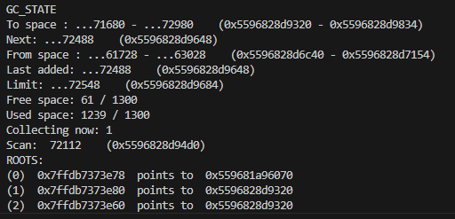
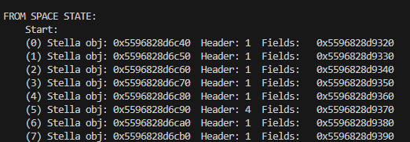
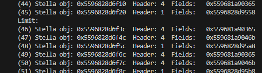
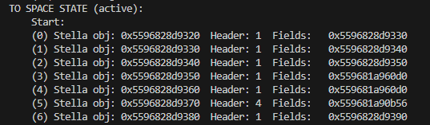
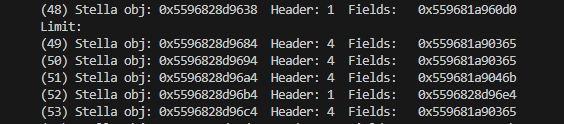
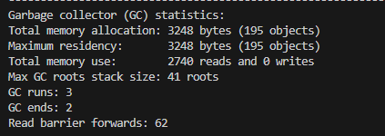

# Garbage Collector lab

[](https://github.com/kechinvv/stella_gc/actions/workflows/cmake-single-platform.yml)

## Description
Incremental (Baker's algorithm) copy GC
## Build

Run `compile_run.sh` with target `.c` example and program input. 3rd arg is size for GS_SPACE_SIZE (optional, default 1300).
```
sudo ./compile_run.sh ./stella_examples/factorial.c 4 1 1400
```
or build manually
```
gcc -std=c11 -DSTELLA_DEBUG -DSTELLA_GC_STATS -DSTELLA_RUNTIME_STATS example/path.c stella/runtime.c stella/gc.c stella/runtime.h stella/gc.h -o ./out/runnable_example
```

If not enough memory - exit with ENOMEM (12)
## Additional flags
`-DGC_LOGS` - enable gc logs

`-DSIMPLE_COPY` - simple copy gc mode
## ENV

`GC_SPACE_SIZE` - int (auto set in `compile_run.sh`).

## Printing

##### GC STATE

In braces - default addresses in hex. Before hex address - int converted last digits for easy debug.

Collecting now - show GC state. If == 1 then collecting (new objects to the end of to space). If == 0 - not collecting (new objects to from space).







Mark `active` - new objects allocate to this space. If gc working - to space, else - from space.





##### STATS

Only 1 change from origin - print count of read barrier's forward (last line)

